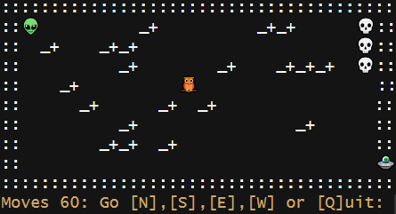
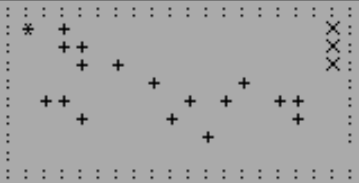

# Creepy Alien

Puzzle game for the R console. Help the alien to find the ship!



## Install & Start

Install from CRAN:

```r
install.packages("creepyalien")
```

Start Game in R-Console (e.g. RStudio)

```r
library(creepyalien)
creepyalien()
```

{creepyalien} is a CLI (Command Line Interface) game. It runs in the RStudio Console. 
If you start it in RGui or Positron, I recommend to turn the animations off.

```r
library(creepyalien)
creepyalien(animate = FALSE)
```

# Gameplay

You are an alien 👽 lost in a graveyard and have until midnight (60 steps) to find your way to your ship 🛸. Skeletons 💀 are waiting to scare you to death should you come to close. You can dig up to 5 holes to help keep them away. And do not fall down the holes. You find it difficult? The owl 🦉 may give you some extra time!

Move the alien:

* N = North (Up)
* S = South (Down)
* E = East  (Right)
* W = West  (Left)

# History 

The gameplay is inspired by 'Gravedigger', written 1983 in BASIC (131 lines of code) by Alan Ramsey for classic home computers like ZX81, ZXSpectrum and Commodore VIC20. The listing of 'Gravedigger' was published in the book 'CREEPY COMPUTER GAMES' which is still available on the Internet Archive: 
<https://archive.org/details/Creepy_Computer_Games_1983_Usborne_Publishing>



The game was ported 2018 to R by Peter Prevos, keeping the code as close as possible to the original.

In 2025 I decided to add some extra spice to the R code by changing the text-characters to UTF8-characters (e.g. 💀 instead of X), adding sound and some little animations. Furthermore, I decided to extend the story line by introducing the alien 👽 that is looking for his ship 🛸. As the game can be quite challenging, I added the owl 🦉 to get some extra moves.

Enjoy the game!


